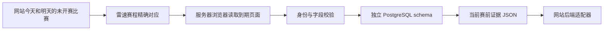

# 线上定时策略（0.3.0）

运行入口为 `scheduled.cjs`，由 `leisu-prematch.timer` 每 5 分钟唤醒。部署后设置 `LEISU_ENABLED=1` 启用策略。程序真实探测服务器浏览器访问，成功才运行现有采集链路；`LEISU_ACCESS_VALIDATED` 的手动值不作为定时器启用条件。

范围：北京时间今天、明天且未开赛的站内比赛；伤停每 6 小时，阵容赛前 90/60/30 分钟检查，未公布时 20/10 分钟补查。源站 403/405 或登录失效时记录实际失败，6 小时后重试；期间定时器继续刷新运行状态，保留旧数据。有效窗口无比赛时不开浏览器。

运行结果写入现有 PostgreSQL 的 `leisu_prematch.scheduler_runs`；伤停、阵容仍写入 `observations/latest_valid`。`LEISU_PUBLIC_DIR` 中的 `collection-status.json`、`latest-evidence.json` 供网站只读访问。共享目录须由 `leisu-collector:football` 持有、权限 2750；原子发布文件权限 0640。浏览器和私有配置仍不开放给网站。

页面展示启用状态、最近执行、下次取数、具体失败原因和逐项内容。赔率自动采集尚未实现，采集数据不自动进入正式推荐。

以下为 0.2.0 的实现和本地验收记录，不能作为当前线上验收结论。

# 雷速赛前采集执行包

当前开发版本：**0.2.0**。本轮仅开发、测试和打包，未进行服务器安装或部署。详细改动见 [CHANGELOG.md](CHANGELOG.md)。

已实现独立服务器采集器、PostgreSQL 存储、任务调度和网站读取适配器。**本包已做本地验证，尚未在服务器安装或完成真实取数验收；等待现有网站优化部署完成后执行。** 默认不开启采集。赔率自动提取没有实现，不能把本包当成全部数据源的替代。

## 采集范围已经固定

以 `Asia/Shanghai` 北京时间的自然日计算，从今天 00:00（包含）到后天 00:00（不包含），并且开球时间必须晚于当前时间。只处理网站当前赛事表里的比赛；竞彩业务日期不参与窗口判断。

例如 2026-09-12 的范围为 9 月 12 日和 13 日：9 月 13 日凌晨的比赛属于明天；9 月 14 日 00:00 起排除。过零点自动滚动，不是从执行时刻向后推 48 小时。

| 项目 | 已实现规则 |
| --- | --- |
| 网站比赛输入 | PostgreSQL `football.match_snapshots` 的 current 数据集，读取同一快照内的发布身份，默认要求最近 60 分钟更新 |
| 可以采集的比赛 | 今天或明天、尚未开赛、双方名称与开球时间已准确映射 |
| 排除 | 已开赛、完场、延期、取消、未知或相互冲突的状态、无时区时间、映射歧义 |
| 新比赛对应 | 从明确配置的雷速联赛页读取赛程，以双方名称、显式别名、开球时刻精确对应；每 6 小时及北京时间跨日刷新；页面超过单轮预算时保存进度，下轮续跑，全部完成后才发布完整对应表 |
| 初始联赛覆盖 | 已核实英超页面 `comp-82`；其他联赛需要加入已验证的页面配置，未匹配比赛显示缺失，不声称已覆盖 |
| 伤停 | 每场每 6 小时一个任务；读取人员、原因、位置、回归描述；Canvas 内数字及日期不编造 |
| 阵容 | 开赛前 90、60、30 分钟阶段检查；30 分钟仍未公布才在 20、10 分钟各补查一次，取得完整名单后停止后续补查；必须核验双方各 11 名首发 |
| 定时器 | 每 5 分钟检查到期任务，加最多 30 秒随机延迟；单次只开一个采集进程，页面顺序读取 |
| 每轮预算 | 默认最多 12 个页面、480 秒；已对应比赛的临近开赛阵容优先，未执行任务留待下轮；没有范围内比赛时不开浏览器 |
| 未公布 | 保存 `source_empty`，不转换成“无伤停”或补齐假阵容；后续时段可再检查 |
| 异常 | 403/405、登录要求、内容解析异常、身份冲突触发暂停并可由 doctor 查看；仅明确网络超时/临时连接失败/HTTP 5xx 自动有限退避，同一时段失败最多再试一次、至少间隔 10 分钟 |
| 开赛后 | 停止赛前采集，移出当前导出；历史观测保留，赛后数据不能回填成赛前证据 |

时间范围只能减少错场、过期和赛后混入风险，不能保证上游数据本身正确。每条数据保留来源、抓取时间、对应赛事及状态，展示时必须显示采集时间。

## 实际处理流程



采集、定时器、浏览器会话及数据库均在服务器。首次登录需要你通过 SSH 隧道在服务器浏览器中正常登录；之后关闭本地电脑不影响任务。登录失效或上游阻断会暂停，仍可能需要再次人工登录。

## 优化部署完成后按顺序执行

完整的安装、数据库权限、私有登录桌面、运行函数和启停命令见 [deploy/部署说明.md](deploy/部署说明.md)。以下命令在服务器解压目录执行：

```bash
sudo bash deploy/install.sh --after-site-optimization
```

然后按部署说明配置专用数据库连接与联赛列表，使用其中的 `leisu_run` 辅助函数执行：

1. `leisu_run doctor`：检查运行环境及默认开关。
2. `leisu_run migrate`：仅建立 `leisu_prematch` 专用表结构。
3. `sudo /opt/football-leisu-collector/login-ui.sh`：你完成服务器浏览器登录，关闭远程浏览器后继续。
4. `leisu_run discover`、`leisu_run plan`：发现对应关系，核对今天和明天的比赛、未匹配及冲突清单。
5. 分别运行两次 `leisu_run probe`：确认重启浏览器进程后仍能读取真实字段。该步骤不写观测库。
6. 验证通过后，设置 `LEISU_ACCESS_VALIDATED=1` 和 `LEISU_ENABLED=1`，执行 `leisu_run collect-once`，检查数据库观测及导出。
7. `sudo systemctl enable --now leisu-prematch.timer`：启用正式定时器。

`probe` 默认验证有真实伤停行的比赛；返回 `source_empty` 说明该场没有结构化伤停行，不足以单独证明完整字段可采。可以用 `--site-match-id sporttery_实际ID` 选择窗口内已有准确映射的比赛。不能通过离线样本或修改系统时钟绕过实际赛前采集检查。

安装需要 Node.js 22.22.1 或更高版本、systemd 和 Debian/Ubuntu 的 apt；会安装独立 Chromium 及所需系统依赖。安装脚本不会启动采集、迁移数据或修改网站代码；现有专用目录冲突时直接退出。

## 网站接入怎么做

`store.cjs` 将原始观测追加到 `leisu_prematch.observations`，有效值指针在 `latest_valid`，任务状态在 `runs`。失败或未公布不会覆盖上次成功值。采集器不写网站原有预测表。0.2.0 新增批量证据读取，每批最多 500 场、一个只读事务内两次 SELECT；保留每场采集前后的最新比赛核验，同时复用本轮数据库连接池。

每次正常运行生成 `latest-evidence.json`，只含当时窗口内的未开赛比赛。`website-adapter.cjs` 接收该 JSON 和网站当前比赛对象，检查导出时效、赛事身份、开球时间，再返回该场伤停/阵容。导出超过 10 分钟，或比赛已开赛、改期、换队时，不作为当前有效结果返回。适配器保留“最近成功值”和“最近尝试状态”，前端应分别展示更新时间及异常说明。

0.2.0 新增 `website-reader.cjs`：`createWebsiteReader` 读取受限大小的 JSON 文件并结合网站当前比赛验证；`createWebsiteHandler` 提供 GET/HEAD 处理函数，必须传入网站鉴权回调，鉴权通过前不会读取比赛或文件。公开返回仅含比赛、伤停/阵容、状态和更新时间，不包含采集网址、provider ID 或原始采集路径。详见 [网站读取接口.md](网站读取接口.md)。

接入时由网站后端调用读取服务，保持已有网站登录验证；浏览器端不持有雷速会话或数据库连接。默认导出位于私有状态目录、权限 0600，**网站当前还没有读取权限或路由连接**。后续接入应只将该 JSON 原子发布到单独的只读共享位置，并为实际网站服务账号设置权限，不能把整个浏览器 profile 或状态目录开放给网站。共享路径也需要同步配置服务的 `ReadWritePaths`。当前导出默认路径无需改变即可完成采集与入库验收。

本包的采集接口尚未挂载到网站。本轮推荐列表与详情展示的本地调整不等于真实采集数据已经接入，正式连接仍需单独验收。所有输出的 `predictionEligible` 固定为 `false`；将数据纳入预测模型还需要独立验收与赛前截断规则，不能仅因“抓到了”就自动提高预测可信度。

## 本地可复现验证

在包目录执行（Windows 使用 `npm.cmd`）：

```bash
npm ci --ignore-scripts --no-audit --no-fund
npm test
node cli.cjs plan --fixtures samples/fixtures.2026-09-12.json --mappings samples/mappings.2026-09-12.json --now 2026-09-12T04:00:00Z
node cli.cjs doctor
```

离线计划使用已记录的 9 场对应样本：应选中 8 场、排除 1 场窗口外比赛，产生 8 个伤停任务，不产生阵容或赔率任务。样本阿斯顿维拉的开球为 `2026-09-12T14:00:00.000Z`（北京时间 22:00）。这些 JSON 仅用于复现测试，生产采集命令拒绝 `--fixtures` 和 `--now` 参数。

0.2.0 在 Node.js 22.22.1 下 **128/128 项本地测试通过**，报告为 `validation-report.json` 和 `validation-tests.tap`。测试覆盖日期边界、映射冲突、任务去重与重试、跨轮进度、501 场导出中断、DOM 样本解析、数据库事务逻辑和鉴权读取接口。数据库测试使用模拟连接，不能代替真实 PostgreSQL 迁移与事务验收；Linux 浏览器登录、重启后的访问、持续运行及真实赔率自动提取尚未完成。

## 正式上线验收条件

- 真实服务器浏览器正常读取，而不是 HTTP 200 的 403 错误页；重启浏览器后再次成功。
- 未匹配清单逐场说明，不把漏采计为已覆盖；选中比赛都符合北京时间今天/明天。
- 至少一场真实伤停和一场即将开赛的完整阵容，核对来源、11+11 首发、ID、抓取时间。
- 连续跨越一个北京时间零点运行，验证新一天纳入、过期移出、定时任务及重复运行幂等。
- 网页改期、数据为空、登录失效时保持正确的缺失/暂停状态，赛后观测不进入赛前结果。
- 网站后台接入后核对伤停、阵容、缺失状态与更新时间，并确认公开响应没有采集网址；赔率另立验收，不把手工截图样本算作自动采集完成。
