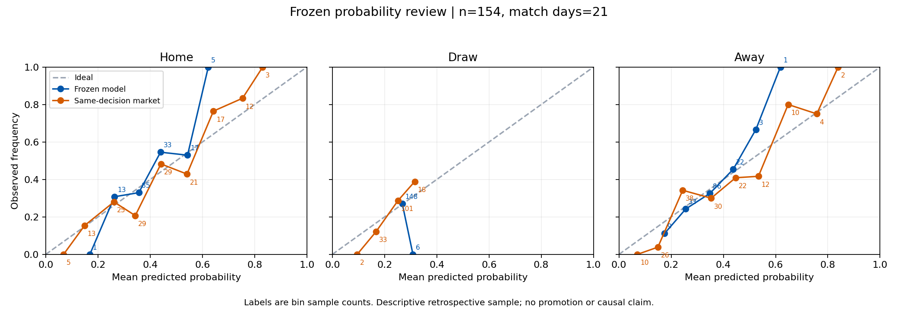

# 2026-10-02 生产历史回归首批结果

已完成真实生产逐场导出、准入、概率复算及回放框架。**本批没有证明模型提升，候选模型没有晋升。** 生产数据库、配置、正式推荐和服务均未改动。

## 输入及样本漏斗

北京时间 2026-10-02 21:49:38–21:50:16，通过已有固定主机密钥 SSH 通道，只读生产不可变 generation：

```text
generationId: g-79b3788d9a6029e3dccaeb3366d04ef0da49a8c01d24457492fe0c370a867273
manifestHash: 79b3788d9a6029e3dccaeb3366d04ef0da49a8c01d24457492fe0c370a867273
sourceCycleId: sporttery-full-sync:2026-09-30T15:34:00.845Z
committedAt: 2026-09-30T15:52:07.943Z
```

这证明读取的是 9 月 30 日发布批次，不是“10 月 2 日业务数据已刷新”。两份原始生产文件分别流式校验完整字节 SHA：历史比赛 127,349,227 bytes，预测快照 766,227,110 bytes。输出原始响应 9,383,766 bytes；最多 500 比赛、50 条一页、10 MiB 响应上限均满足。没有查询数据库、导入线上业务模块或传回完整快照库。公开采集公钥表单独捕获并核对前后相同；采集签名/提取承诺在本地复验，未重新下载原提供方 HTTP payload。

| 准入阶段 | 场数 | 解释 |
|---|---:|---|
| generation 历史文件总行数 | 2,272 | 本轮独立流式数出 |
| 9 月窗口外 | 1,840 | 未作逐场导出 |
| 9 月独立已结算比赛 | 432 | 全量选入，无上限截断、无输赢筛选 |
| 有选中截止前快照 | 379 | 同一比赛只选最后一条快照 |
| 冻结概率及基础时钟可评分 | 180 | 占窗口 41.67% |
| 同决策签名官方 SP 可配对 | 154 | 占窗口 35.65%，21 个比赛日 |
| 具备逐字段时间证据的特征回放 | 0 | 不以特征存在/哈希替代来源与可用时间证明 |

互斥最终去向为：154 场配对准入、199 场决策时钟合同拒绝、53 场缺少选中冻结决策、26 场缺少同决策 SP。199 场具体为选中快照 `capturedAt > decisionAt`；这可能涉及重复观察旧决策，不能直接断言预测使用了未来赛果。需要恢复原决策与首次归档/后续再观察的对应关系，不能修改旧时钟使其过关。

9 月 30 日线上聚合报告的“283 场合格赛前概率／145 场严格准入”**尚未独立复现**。它使用不同的概率选择链，并另有历史特征训练量和 watermark 准入；本批从不可变文件按明确时间窗和最新冻结决策建立 154 场事件集。不得把 154 场的数字同 145 场直接相减后称作线上提升。

## 独立复算结果

以下两组使用完全相同的 154 场、同一条冻结决策的模型概率和官方 SP。市场采用三项倒数按和归一去水。

| 指标 | 原冻结模型 | 同决策市场 | 模型减市场 |
|---|---:|---:|---:|
| Brier（三类平方误差和） | 0.624795 | 0.559585 | +0.065210 |
| LogLoss（自然对数） | 1.040061 | 0.942898 | +0.097163 |
| 方向命中率 | 50.65% | 53.90% | −3.25 个百分点 |

按 21 个比赛日整块配对 bootstrap，1,000 次、固定种子 20261002。Brier 差值 95% 区间 `[+0.029707, +0.117658]`，LogLoss 差值 `[+0.047744, +0.169975]`，方向命中率差值 `[−8.92, +2.25]` 个百分点。本批概率评分支持市场表现较好；方向命中率差值区间跨零。区间只描述这个有准入选择的回顾性样本，不是跨联赛长期收益或正式晋升证明。

模型版本构成为 v73 45 场、v75 90 场、v76 19 场，不能把混合历史模型视为单一当前版本。原冻结模型最大概率方向为主胜 98、平 0、客胜 56；市场为 92、0、62；实际为 64、40、50。两者有 26 场方向冲突。最大概率不选平局本身不证明错误，不能强塞平局；应结合完整三分类概率评分与可靠性曲线判断。



图上的数字是分箱场数。完整主/平/客、25 个原始联赛标签、SP 区间及缺失字段分组在 `report/review.json`；联赛别名未擅自合并。小组样本较少，不能据此宣称联赛迁移效果。`report/per-match-evidence.jsonl` 保留全部 432 场及其具体拒绝原因；`report/attributions.json` 中的数据缺失/时钟/市场冲突是描述性标签，不是因果归因。

## 候选回放与当前不足

预先保存的协议包含两个向前扩展窗口和独立 9 月 23 日至 10 月 1 日测试窗。同比赛日整组处理，标签必须在下一阶段最早实际决策前可得。早期训练窗 45 场经观察时钟准入后剩 0；扩展训练窗 47 场剩 2。透明类别频率基线因此均以 `insufficient-training-rows` 停止，未挑选候选。最终测试窗有 47 场，但没有可用候选状态；不能拿这些赛果补训再称测试成功。

154 场配对样本中，84 场保留的结果观察日期为 UTC 9 月 30 日；结果回执距开赛的中位时间约 237.05 小时。此处仅说明该 generation 保存的回执时间，不能称为提供方首次产生结果的时间。为了真实向前回放，需要原始首次可信结果观察证据；不能反推或回填。

Elo、Poisson、联赛先验在部分冻结输入中有值，但仍缺逐字段来源/时间准入。Form 的 355 条导出省略有明确标记，不等于生产未采集；24 条保留值也不自动具备真实 as-of 证明。阵容、伤停、天气、真实 xG、赛程密度在本次白名单冻结输入中没有可用字段证据；不能用赔率推导 λ 冒充真实 xG。

现有 `dynamicGoalStrengthModel.cjs` 已实现动态 Elo/Poisson/Dixon-Coles，本分支没有重复实现或载入旧本地种子。后续按 [方案及接口](history-regression.md) 补齐事件时间和字段证据，再接入 02 分支的固定版本候选，独立校准、验证选型、保留测试和逐特征消融。正式推荐继续要求数据、模型、单场三层门槛同时通过。

## 交付与验收

- 原始响应及线上捕获：`outputs/history-regression-20261002/online-sample-v3.json[.remote-response.json]`。
- 准入全量证据：`outputs/history-regression-20261002/admission-v3.json`。
- 报告：同目录 `report/summary.json`、`review.json`、`replay.json`、`per-match-evidence.jsonl`、`attributions.json`、`reliability.png`。
- SHA 清单：同目录 `delivery-receipt.json` 和 `report/report-manifest.json`。
- 验证：33 项 Node 合成测试 + 12 项 Python 合成测试通过；实际导出原始响应 SHA、旧回执 generation/manifest 绑定、签名/时钟和 432 个 ID 已核验。早期 v2 导出与 `admission.json` 仅为投影调试材料，最终结果只使用 v3。

未执行 ROI/回撤计算、部署、自动晋升或正式推荐回写。本分支的离线准入代码基于 `6fce1805`，不能把其修复视为线上 r785 后端已经改善。
