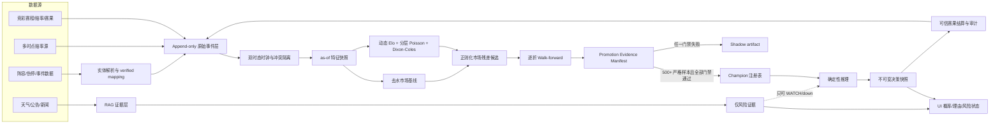

# 足球预测系统：UI、架构、底层算法与预测能力审计

更新时间：2026-07-16
审计范围：当前本地代码、隔离回测 artifact、历史训练仓库与晋级门禁。本文不代表已经部署或生产上线。

## 1. 结论先行

系统现在具备较完整的离线证据骨架：决策时钟、不可变快照、赛果来源审计、as-of 特征、walk-forward 回放、内容寻址 artifact、晋级 manifest 和 Champion 注册表已经具备。但生产数据发布尚未形成整轮 generation transaction，自主学习也只能在不可变账本中登记 Shadow 候选，不能据此自动扩权。当前仍是 **Shadow（影子评估）状态**，没有足够证据对外声明正式命中率。

| 口径 | 当前证据 | 能否用于晋级 |
|---|---:|---|
| fresh isolated rolling-backtest-v16 输入 | 2,416 场比赛 / 7,829 个预测快照 / 858 条赔率 | 否；这是隔离回测输入规模，不等于有效晋级样本 |
| 诊断概率样本 | 181 场；准确率 56.91%，Brier 0.5827，Log Loss 0.9785 | 否；仅用于排查模型行为 |
| legacy 市场配对样本 | 152 场 | 否；不是同一决策时点的严格配对 |
| legacy 配对上的当前模型 | 准确率 53.95%，Brier 0.6024，Log Loss 1.0084 | 否 |
| legacy 配对上的市场基线 | 准确率 58.55%，Brier 0.5287，Log Loss 0.8955 | 否；只能作诊断参考 |
| promotion evidence | 6 条，总计 0 条 eligible | 否；主要缺决策时钟与赔率来源时钟 |
| 残差模型严格训练样本 | 0 条 | 否；无法拟合 final residual candidate |
| 严格 promotion cohort | 0 场 | 否；尚无可晋级评估集 |
| 正式、可审计推荐 | 0 场 | 否；正式推荐命中率未知 |
| 动态强度影子模型 | 10,000 条研究输入，8,466 条评估 | 否；研究数据且无严格市场基线 |
| 历史赔率大样本对照 | 20,000 条输入，19,685 条可评估，14,298 条严格留出 | 否；赔率缺 provider 观测时钟，只能研究 |

legacy 152 场上，模型比市场少 4.60 个准确率百分点，Brier 劣化 0.0737，Log Loss 劣化 0.1129。更重要的是，这 152 场的市场价格存在明显时间错配：配对 lag 的中位数为 **40.08 分钟**，P90 为 **1,060.27 分钟**，最大为 **3,204.14 分钟**；91 场超过 5 分钟，41 场超过 6 小时。因此这些数字只能回答“旧样本上模型大致表现怎样”，不能回答“模型在真实决策时点是否优于市场”。

最新一次隔离 `rolling-backtest-v16` 再次验证了这个边界：2,416 场比赛、7,829 个预测快照和 858 条赔率最终只形成 181 条诊断概率行、152 条 legacy 同场市场配对，严格 promotion 仍为 0。6 条 promotion evidence 全部不合格，主要阻断项是 `decisionAt` 不合格、`modelGeneratedAt` 晚于决策、赔率 `observedAt` 缺失、`receivedAt` 缺失、`sourceCycleId` 缺失；其中部分行还缺同场市场、赔率或完整概率。残差 walk-forward 的严格训练行数为 0，因此没有可用于注册或激活的 final residual model。诊断准确率 56.91% 不能被解释成正式命中率。

动态强度模型在 10,000 条研究行上得到 8,466 条评估：准确率 **49.1023%**、Brier **0.617413**、Log Loss **1.028780**。同一研究口径下，Poisson 基线为 **49.0078% / 0.616517 / 1.027262**。动态模型只在准确率上微增 0.0945 个百分点，但 Brier 和 Log Loss 均更差，且数据的派生可用时间不满足严格晋级条件，不能晋级。

为避免被 181/152 场旧样本误导，又从 230,554 条历史仓库事件中识别出 227,518 条完整 HAD 三项赔率，并在最近 20,000 条上做了只在训练窗选权重的逐折回放。14,298 条留出记录中，去水市场为 **49.9720% / Brier 0.601008 / Log Loss 1.004505**，动态模型为 **47.4892% / 0.623522 / 1.037593**。动态模型比市场少 **2.4829 个命中率百分点**，Brier 劣化 **0.022513**，Log Loss 劣化 **0.033088**。自动混合器把权重退回到几乎纯市场后，Brier 和 Log Loss 仍分别比市场差 **0.000146** 和 **0.000039**，因此没有可声明的模型 Alpha。

这批大样本的 `marketOddsObservedAt`、`receivedAt` 与 `sourceCycleId` 覆盖率仍为 0，赛果 availability 也是派生值，所以严格 promotion 样本仍是 **0**。它足以否定“当前模型已明显优于市场”，却不能证明某个候选可上线。

所以当前最准确的能力判断是：**系统已经能诚实地阻止坏证据上线，但尚未证明模型具有稳定、可交易的市场增量。**

## 2. 总体架构

架构中的关键边界：

- 结构化比赛数据先经过来源、实体、时钟和冲突审计，再生成预测时点可见的特征。
- 模型候选必须在每个时间折内“先预测、后更新”，不能在全量数据训练后回测过去。
- RAG/Web Consensus 永久为 **risk-only**：可以触发 `WATCH` 或下调信任，不能进入数值概率、改变推荐方向或上调置信度。
- UI 只能展示已经冻结到决策快照中的概率和证据状态；Shadow 结果不应伪装成正式推荐。

## 3. 底层数据与时钟逻辑

### 3.1 双时态记录

每条可训练事件至少需要以下字段：

- `observedAt`：数据提供方声称信息产生或发布的时间；
- `receivedAt`：本系统真实收到响应的时间；
- `sourceCycleId`：本轮抓取的稳定周期 ID；
- `source`、`sourceVersion`、`eventVersion`：来源和赛事版本；
- `forecastTime`、`modelGeneratedAt`、`decisionAt`：预测生成与冻结时钟；
- 内容哈希、原始响应哈希和实体映射版本。

严格 as-of 规则是：只有在 `forecastTime` 之前真实可见、且来源链完整的数据才能进入该场预测。赛果还必须具备可信官方来源、显式观测时间、开赛后时序和一致的赛事版本；系统已删除用“开赛后 3 小时”推导赛果可见时间的捷径。

### 3.2 不可变决策快照

概率、HAD/HHAD 盘口、SP、特征水位、模型版本和所有时钟必须来自同一份不可变决策快照。外层可变对象、后补字段和旧缓存都不能补齐晋级证据。这样才能证明“当时究竟看到了什么”，避免用赛后信息修饰历史预测。

### 3.3 历史训练仓库 v3

当前私有 SQLite 使用 `historical-training-sqlite-v3-availability-commitment`：

- 接收 230,554 条事件；
- 隔离拒绝 3 条；
- 冲突 0 条；
- 数据库大小 295,829,504 B；
- 重复导入增长 0 B；
- 所有使用派生 availability 的公开历史行均标记 `strictPromotionEligible:false`。

这批历史数据可以用于球队强度先验、冷启动研究、实体候选和算法烟雾测试，但不能替代真实赛前抓取快照，也不能直接构成晋级证据。

### 3.4 实体主数据

外部 provider 数据只有在球队、联赛和赛事映射已经由注册表精确验证，或在当前抓取周期完成实时验证并提交后，才能参与结构化特征。旧缓存、局部名称命中和 `lastSearchAt` 不能自证可信。

当前 **verified mapping 为 0**，因此阵容、伤停、xG 等 provider enrichment 必须 fail-closed；这是当前预测能力最大的工程性数据缺口之一。

### 3.5 前瞻 fixture 快照采集

Football-Data `fixtures.csv` 前瞻快照采集器已经接入同步 worker 的低频 enrichment 队列。采集器保存原始响应、内容哈希、HTTP `ETag` / `Last-Modified`、本系统接收时间和不可变元数据，并支持 `304 Not Modified`，用于从现在起积累可追溯的赛程与赔率研究快照。

状态指针使用跨进程独占锁和按 `receivedAt` 单调发布的 CAS：并发请求乱序完成时，旧响应仍可保存为不可变研究快照，但不能回滚 `status.json`、ETag 或 Last-Modified；崩溃遗留锁有超时恢复验证。

这条数据链当前明确标记为 **research/shadow only**：上游文件没有可证明的 provider 赔率观测时钟，授权边界也不能被推定为生产再分发许可，因此它不能补造历史 point-in-time 证据，不能作为官方赛果，也不能进入 promotion cohort。接入 worker 代表采集自动化已开始，不代表晋级数据已经齐备。

### 3.6 Sporttery 采集时钟与原始响应链

Sporttery relay 采集器现在在每个网络请求前记录 `requestedAt`，响应完成后记录 `receivedAt`，同一轮使用 collector-owned `sourceCycleId`；同时保存 URL、method、HTTP status/Date/ETag、原始字节数与 SHA-256。provider `observedAt` 只从响应中的 `updateDate + updateTime` 推导，不能回退为 HTTP Date 或本机接收时间；304、网络失败和解析失败也不能伪造 provider 时间。

这解决的是“新采集事实如何留证”，尚未自动修复旧快照。fast-result 合并上传现在使用独立的 upload-merge cycle，并保留每个 endpoint 的原 collector cycle、时钟、HTTP 元数据和原始哈希；不同采集周期不再伪装成一个 provider cycle。`syncData` 对全部 provenance 字段的严格消费，以及服务端原样保存后的端到端哈希连续性仍需单独迁移和验证。

## 4. 模型逻辑与实现方式

### 4.1 市场基线

HAD 三项赔率先转为隐含概率，再去除庄家水位，得到同场市场参考分布。模型不是只和“猜主胜”比较，而是必须在相同比赛、相同决策时点、相同温度校准口径下，同时改善 Brier 和 Log Loss。

### 4.2 动态球队强度影子模型

当前研究实现包含：

- 动态 Elo：按比赛结果更新相对强弱，并按时间衰减；
- 分层攻防 Poisson：球队攻击/防守强度向联赛和全局先验收缩，处理小样本与冷启动；
- 主场优势、近期比赛权重与联赛均值；
- Dixon-Coles 低比分相关修正；
- 日期批次的 predict-before-update，避免同日未来结果进入先前预测；
- 独立特征哈希、标签哈希、artifact 哈希和数据水位。

这套模型当前只证明“实现可回放、能在研究数据上运行”，没有证明优于市场。下一步应将固定全局参数升级为联赛分层、可时间衰减的参数，并只在严格时点数据上调参。

### 4.3 市场残差候选

残差模型把去水市场对数概率作为 offset，只学习球队强度、阵容、伤停、赛程密度和盘口移动相对市场的增量。每个 walk-forward fold 必须重新拟合，超参数只能在该折内部选择，避免把未来窗口用于调参。

旧诊断中最好的固定候选实际是 `model weight = 0` 的纯市场温度调整。这说明当前最优候选没有可证明的模型 Alpha，而不是可上线的胜利。

### 4.4 晋级与激活

候选只有同时满足以下条件，才可能从 Shadow 变为 Active：

1. 至少 500 条严格、同场、同决策时点的 promotion evidence；
2. promotion evidence manifest 完整、无冲突，内容哈希验证通过；
3. 至少 6 个互不重叠的时间外推窗口，Brier 与 Log Loss 稳定优于市场；
4. HAD/HHAD 按生产策略精确回放，所有输入与赛果时钟合格；
5. 当前 evaluation candidate artifact hash 与模型注册表中的 Champion hash 完全一致；
6. Champion artifact 存在，且注册表事件链证明它确实经过晋级，而不是手工改状态。

当前严格 promotion cohort 为 0、Champion 为空或不匹配时，激活逻辑保持 `shadow-blocked`。纯市场候选也不能绕过 manifest 和 Champion 权限链。

正在累计的前瞻账本增加了发布保护：若门槛规范发生变化且活动账本已经产生决策、排除、结算或复核证据，`model:backtest` 默认中止，不再由普通发布静默退休旧账本。只有显式设置程序输出的、同时绑定旧 `gateSpecHash` 与新 `gateSpecHash` 的 `CANDIDATE_PROSPECTIVE_GATE_RESET_AUTHORIZATION`，才允许开启一轮新的前瞻试验；零证据账本仍可安全重冻。该授权不是命中率晋级授权，也不能把旧样本回填到新账本。

### 4.5 AI 与 RAG 应放在哪里

系统需要 AI，但不需要让 LLM 直接“猜比分”或修改概率。合适的职责是：

- 从官方公告、伤停名单、发布会和赛程变更中抽取候选事实，连同 URL、发布时间、抓取时间、原文哈希和实体候选进入人工或规则复核队列；
- 辅助实体解析、异常归因、数据质量报告、模型漂移解释与 UI 自然语言说明；
- RAG 只检索可追溯原文，并要求至少两条独立来源或一条官方来源；无法结构化验证时只产生 `WATCH`/风险降级；
- 禁止 LLM 输出直接进入概率、推荐方向、晋级状态、账本指针或投注额度。若未来要把文本转为数值特征，必须先建立带时钟的结构化标签集，再像任何模型特征一样做消融、泄漏审计和 walk-forward。

因此当前优先级不是增加“更强聊天模型”，而是补齐 point-in-time 数据、实体主数据和 generation 一致性；AI 是证据处理器与审计助手，不是晋级授权者。

## 5. UI 应如何表达真实能力

UI 的核心不是制造“高命中率”观感，而是让用户分清结果属于哪一种证据层级：

- `Shadow / 观察`：概率可用于研究展示，但不是正式推荐；
- `数据不完整`：缺决策时钟、实体映射、阵容或同刻赔率时，明确显示缺口；
- `风险降级`：RAG/公告/天气只能增加风险提示或降低信任，不能显示为概率加成；
- `正式推荐`：只有通过 manifest 与 Champion 门禁的冻结快照才可使用该标签；
- 命中率面板同时展示样本量、时间范围、Brier、Log Loss、市场基线和严格样本占比。

在正式可审计推荐仍为 0 的情况下，UI 不应展示“正式推荐命中率”；可以展示带有“诊断、不可晋级”标识的研究指标。

## 6. 当前预测能力为什么仍不足

### 6.1 可确认的能力

- 能生成确定性的赛前概率并冻结输入；
- 能用 Elo、分层 Poisson、Dixon-Coles 和市场残差结构建立候选；
- 能做日期隔离的 walk-forward 和内容寻址 artifact；
- 能发现时点错配、赛果来源不可信、实体映射缺失和证据不足，并 fail-closed；
- 能把 LLM/RAG 限制在风险与解释层，不让文本共识直接控制数字方向。

### 6.2 尚不能确认的能力

- 不能声明正式推荐命中率，因为正式可审计推荐样本为 0；
- 不能声明模型优于市场，因为严格同决策时点配对样本为 0；
- 不能证明动态强度模型具有稳定增量，其研究指标并未全面优于 Poisson；
- 不能稳定利用阵容、伤停、xG 等数据，因为 verified entity mapping 为 0；
- 不能用 181 场诊断样本或 152 场 legacy 配对替代 promotion cohort。

### 6.3 生产架构的关键缺口

当前所谓“atomic”只分别覆盖单个 JSON rename、单次 SQLite 事务和一次 React state 合并，没有共同的 generation commit 边界：

- `syncData.cjs` 依次公开 current、history、odds、snapshot、calibration、strategy 等文件，全部替换后才更新 `sync-meta`；中途失败会产生新旧混合批次。
- `optimizePredictionStrategy.cjs` 仍会独立改写已发布的 current、calibration 与 metadata；如果不先把策略变成内容寻址 overlay，它会破坏任何 core manifest。
- DataStore 和 SQLite exporter 分别读取多个活动文件后才开启自己的事务，因此可能“原子地保存一份混合输入”。
- 服务端请求没有先固定 generation context；前端 current、history 与 meta 也会分别提交，生命周期防回退不能证明赔率、模型、计数来自同一轮。

本轮已经新增独立的 generation store 基础协议和故障注入验证，但尚未接管 `syncData`、服务端、DataStore、SQLite 与前端。因此在这些入口全部迁移前，只能说“协议基础已实现”，不能说线上数据事务已经修复。

同步 worker 已先做一层评估防护：所有 JSON 富化结束后重新执行数据校验和 SQLite 导出，并要求 public 与 SQLite 的 `sourceCycleId` 完全相同，才允许回测和学习链运行。这能阻止已知的跨代评估，但不等价于整个发布链已经成为单一 generation transaction。

决策冻结顺序也已修正为 `toAppMatch → odds trend → external signals/result → rebuild final model → applyPredictionPersistence once → snapshot`。最终 base/unified 模型、概率、HAD/HHAD 市场、feature snapshot 和 source cycle 在同一最终化边界冻结，避免此前 `modelGeneratedAt > decisionAt`。旧快照不会回填；若一次长同步在计算期间跨过停售时刻，当前 promotion 审计会拒绝该行，但发布层仍建议再增加“开始未截止、完成已截止则不发布新决策”的显式门禁。

### 6.4 自主学习的安全边界

旧学习链存在候选身份错配：注册表曾从 `shadowCandidates.bestModelCandidate` 取证据，却把 residual walk-forward 最后一折哈希当模型身份；同时实际 feature schema 常量在训练器与优化器中拼写不同，真实候选会永久 fail-closed。本轮已改为：

- 对所有严格样本做完整 OOS 评估后，用同一 canonical 数据重新拟合 final residual model；持久化参数、参数哈希、数据哈希、schema 哈希与 `trainedThrough`。
- candidateId 固定为 final `modelHash` 的函数；注册表证据只引用该 final candidate，不再拼接另一条 shadow 候选路径。
- Champion 权威身份与待上线 `modelSignal` 现在必须逐字段精确匹配 9 个字段：`candidateId`、`candidateType`、`artifactHash`、`modelHash`、`trainingDataHash`、`parametersHash`、`featureSchemaHash`、`metricsManifestHash`、`trainedThrough`。此外，规范候选 manifest 还绑定固定权重、feature set、metrics、comparison、rolling、performance manifest 和全部 fold manifest；任一内容被替换，状态即为 `champion-identity-mismatch`，信号保持 Shadow，不能进入 guarded-active。
- 不可变 SQLite 学习账本使用哈希链、内容寻址 artifact、状态机、租约与单调 fencing token；普通 UPDATE/DELETE 被数据库触发器拒绝，外部 head anchor 可签名。普通 append API 不能写 `PROMOTED` / `ROLLED_BACK`；授权推广和回滚必须在同一事务中校验租约、fencing、cycle head、当前代次、当前制品和直接前任制品，已消费或已被后续事件取代的授权不能重放。
- 自主学习周期已经接入同步 worker，并以确定性 cycle ID 去重；相同证据重复运行不会制造新的学习事件。即使 manifest 哈希完整，只要 residual 或规范候选的 `candidateReady` 为 false、存在内部 blocker、不是 shadow-only，周期也必须 `REJECTED`。当前自动周期只允许 `REGISTERED_SHADOW` 或 `REJECTED`，不写 `PROMOTED`，也不切 active model pointer。生产激活仍需独立的 Champion、canary 与回滚授权。

### 6.5 Gemini Pro 独立审计的风险确认

使用 Gemini Pro 进行的独立复核与本地审计结论一致，重点指出五类风险：

1. 派生 availability 可能造成时间穿越；必须永久排除出严格晋级集。
2. 市场基线存在时点错配和去水/校准口径污染；必须保存多时点原始赔率并同刻配对。
3. 实体映射一旦错误会污染阵容、伤停和历史强度；必须用 MDM 注册表和当前周期验证。
4. 固定的全局 Dixon-Coles 参数无法覆盖不同联赛与时期；应做分层、动态估计和冷启动收缩。
5. 当前最优候选的模型权重为 0，说明模型 Alpha 尚未被证明；不能把市场校准改善误写成模型能力。

独立审计用于发现盲点，不替代本地时钟、数据和回测证据门禁。

## 7. 缺失数据、影响与获取方式

| 优先级 | 缺失内容 | 为什么重要 | 建议获取方式 | 入库要求 / 验收标准 |
|---|---|---|---|---|
| P0 | 同决策时点的历史赔率快照 | 建立真正可比的市场基线与 CLV | 竞彩官方分钟级自采；补充 [The Odds API](https://the-odds-api.com/liveapi/guides/v4/) 历史/多 bookmaker 快照 | 原始三项赔率、盘口、bookmaker、`observedAt/receivedAt/sourceCycleId`；严格 lag 阈值 |
| P0 | 完整决策时钟与可信赛果观测 | 消除未来信息和伪结算 | 赛程、开售、赔率、停售、赛果全部 append-only 监听 | 预测与结果事件版本一致；缺任一时钟即 fail-closed |
| P0 | 球队/联赛/赛事 verified ID | 让外部特征能正确落到比赛 | 官方名单 + provider ID；人工审核别名；建立 MDM 变更日志 | 当前 verified mapping 从 0 起积累；禁止旧缓存自证 |
| P0 | 严格历史赛前特征快照 | 训练残差模型和动态强度模型 | 从现在持续抓取；历史采购只接受 point-in-time 数据 | 特征 watermark 早于预测；派生 availability 不可晋级 |
| P1 | 首发、阵型、伤停、停赛 | 捕捉临场强弱和不确定性冲击 | [API-Football](https://www.api-football.com/news/post/how-to-get-started-with-api-football-the-complete-beginners-guide) lineups/injuries/fixtures；球队与赛事官方公告交叉验证 | 账号恢复、实体映射通过后才启用；保存首次发布与每次修订 |
| P1 | 事件级 xG、射门质量、压迫与控球位置 | 估计比比分更稳定的真实强度 | [StatsBomb Open Data](https://github.com/statsbomb/open-data) 做研究验证；当前赛事使用有许可的商业数据 | 记录数据许可、赛事覆盖、provider event ID 和版本 |
| P1 | 赛程变更、休息天数、旅行距离 | 解释疲劳与轮换 | 官方赛程轮询、航程/地理数据，重赛与延期单独建事件 | 只能用预测前已确认的赛程版本 |
| P1 | 裁判、红黄牌倾向 | 改善点球、红牌和比赛节奏先验 | 联赛官方裁判指派与事件源 | 指派发布时间必须早于预测；联赛层级收缩 |
| P1 | point-in-time 天气 | 风雨、温度对节奏和进球分布有影响 | [Open-Meteo Historical Forecast](https://open-meteo.com/en/docs/historical-forecast-api) 或保存自建预报快照 | 保存当时预报，不得用赛后实况冒充预测时天气 |
| P2 | 阵容价值、工资与转会状态 | 冷启动和跨联赛先验 | 合法授权的 squad value/wage 数据，配合赛季有效期 | 建立生效区间，避免把未来转会回填到历史比赛 |
| P2 | 新闻、发布会、场地与动机证据 | 识别结构化源未覆盖的短期风险 | 官方公告优先，RAG 双来源抽取 | 永久 risk-only；保留 URL、发布时间、抓取时间、摘录哈希 |

API-Football 当前账户处于 suspended 状态时，不应反复使用旧缓存模拟“已接入”；应先恢复账户、重建 verified mapping，再按能力审计队列逐项回填。公开历史结果仓库可继续用于研究和先验，但不能补造真实的历史可见时间。

当前已启用的 Football-Data fixture 快照只能承担“从现在开始留存研究/影子证据”的角色。要把样本升级为 promotion evidence，仍需另外取得并持久化 provider 明确给出的赔率 `observedAt`、本系统 `receivedAt`、稳定 `sourceCycleId`、原始响应哈希、同场实体映射，以及可信赛果的独立观测时钟；缺任一项都继续 fail-closed。

## 8. 优化顺序与验收标准

### P0：先让评估可信

1. 把 generation store 接到 `syncData`、optimizer overlay、服务端固定读取上下文、DataStore、SQLite 与前端一次提交；跨文件故障时活动 pointer 必须保持旧批次。
2. 持续采集同决策时点赔率、特征与赛果事件，把严格 promotion cohort 从 0 增长到 500+。免费 fixture 源先进入 research/shadow；只有明确 provider 观测时钟、接收时钟、原始响应哈希和实体映射的数据才能进 promotion。
3. 完成实体 MDM，先覆盖当前赛程全部球队/联赛，再恢复 provider enrichment。
4. 对所有 legacy 配对输出 lag 分布；超过阈值的市场行不进入性能比较。
5. 为每轮评估生成 promotion manifest，并让 final residual candidate、学习账本 artifact、Registry Champion 与生产推理 schema 四方哈希一致。

验收：整轮 generation 故障注入与并发读取通过；严格样本为 500+，时钟和实体覆盖 100%，无派生 availability、无冲突、无外层 fallback。

### P1：再提高模型信息量

1. 接入多时点赔率变化、首发、伤停、停赛、赛程变化和 point-in-time 天气。
2. 将 Dixon-Coles 与攻防强度改为联赛分层、时间动态、冷启动收缩。
3. 用 nested walk-forward 做超参数选择，并保留纯市场、Poisson、Elo 三类基线。
4. 分联赛、赛季、主客强弱、赔率区间做校准与稳定性切片，避免整体均值掩盖局部失效。

验收：至少 6 个互不重叠窗口中，Brier 与 Log Loss 均稳定优于同刻市场，且收益不是由单一联赛或少量异常样本驱动。

### P2：最后才谈产品化命中率

1. Champion 通过后仍以小流量、可回滚方式积累正式推荐。
2. UI 同时披露样本量、概率校准、市场对照、CLV、命中率和策略版本。
3. 将“预测是否正确”和“赔率是否有价值”分开：高命中率不等于正收益，低赔率主胜会天然抬高命中率。

验收：正式、可审计推荐达到预设样本量，且线上冻结快照与离线回放完全一致后，才发布正式命中率。

## 9. 当前状态边界

- 当前状态：`shadow-blocked`。
- 严格 promotion cohort：0。
- 正式可审计推荐：0。
- verified entity mapping：0。
- fresh isolated rolling-backtest-v16：2,416 场比赛 / 7,829 个预测快照 / 858 条赔率；181 条诊断概率行（56.91% / Brier 0.5827 / Log Loss 0.9785），152 条 legacy 同场配对。
- promotion evidence：6 条、eligible 0；主要缺决策时钟、赔率 `observedAt` / `receivedAt` / `sourceCycleId`；残差严格训练行数为 0。
- 历史赔率研究留出：14,298；动态模型相对市场命中率 -2.4829 个百分点，Brier/Log Loss 均无正增益。
- 学习自动化：自主 Shadow 周期已接同步 worker；只允许 Shadow/Rejected，不可变账本可用，生产 active pointer 不自动切换。
- 前瞻数据：Football-Data fixture 快照采集已接同步 worker，但仅用于 research/shadow，不能进入 promotion。
- 数据发布：generation 协议基础已实现，但现有同步、API、SQLite 与前端尚未完成迁移。
- Web/RAG：永久 risk-only，不进入数值方向。
- 采集时钟：Sporttery 新采集器已能保留请求/接收/provider 三类时间和原始响应哈希；fast-result 合并保留 constituent cycles，旧快照不会补造这些字段，服务端端到端哈希连续性仍待完整贯通。
- 决策时钟：最终模型重建后只冻结一次决策，新增回归证明 `modelGeneratedAt <= decisionAt` 且最终概率/市场/feature/sourceCycle 同源；长同步跨停售边界仍建议增加发布层硬门禁。
- 评估代次：worker 已在富化后重新校验/导出并校验 public/SQLite `sourceCycleId`；完整 generation transaction 迁移仍未完成。
- 激活权限：500+ evidence + 有效 manifest + `modelSignal` 与 Registry Champion 的 9 字段身份及完整候选内容完全一致；任一 mismatch 均保持 Shadow。
- 本文结论来自本地代码和隔离 artifact；未声称这些改动已经部署或在生产环境生效。

## 2026-07-16 实施更新

### 结论与当前预测能力

- 正式、可审计推荐的已结算样本仍为 0，因此正式命中率仍为空，不能用诊断样本或 legacy 配对样本替代正式命中率。
- 当前诊断集为 181 行：Accuracy `56.91%`、Brier `0.5827`、Log Loss `0.9785`。这些数字只用于诊断，不满足 promotion evidence 的时间、来源和同刻市场基线要求。
- 152 行 legacy 同场配对中，模型 Accuracy 为 `53.95%`，同期市场为 `58.55%`；模型尚未证明优于市场。
- 14,298 行 holdout 研究中，动态策略 Accuracy 为 `47.489%`，市场为 `49.972%`；该研究同样没有证明稳定的市场增量，不能作为上线或宣传依据。
- 因此系统当前仍应保持 `shadow-blocked`：可以生成可复现概率、发现证据缺口并拒绝不合格样本，但没有可发布的正式命中率，也没有已证明的稳定市场 Alpha。

### 已完成的本地底层布线

1. **可信赔率采集与 promotion 证据**
   - signed collector v2 使用独立 Ed25519 采集器身份，把 provider、官方 URL、请求/接收/provider 时钟、HTTP 元数据、原始响应哈希、规范化载荷哈希，以及 HAD/HHAD 提取哈希绑定到同一个承诺中。
   - 同步端只信任显式、只读的公钥 trust registry；载荷自带公钥、未知 key、伪造 `verified`、签名或市场内容被替换时都必须 fail-closed。
   - 当前 strict eligible 仍为 0。生产采集器尚需在仓库外生成并保管私钥，同时把对应公钥登记到 trust registry；在完成该运维步骤并积累真实 point-in-time 样本前，不能提升候选模型。

2. **一致的数据代次**
   - 本地工作流已经完成 `worker → immutable generation → SQLite → API` 的纵向布线，并包含内容寻址、原子 pointer、读者租约、保留策略和语义 no-op。
   - 该链路尚未部署。当前活动数据缺少有效 `sourceCycleId`，因此没有生成生产 generation pointer；这应被视为 fail-closed 的真实状态，而不是“已上线”。

3. **Web、RAG 与 LLM 的权限边界**
   - Web/RAG 证据永久只用于展示、解释和人工建议，不进入概率计算，不改变推荐方向，不施加数值风险惩罚，也不参与候选晋级。
   - LLM 只能读取经过筛选的结构化 retrieval bundle；原始网页、自由文本指令和完整 external-signal payload 不进入提示词。非空审阅必须返回被检索集合内的 `evidenceIds`，证据越界、时钟越界、内容篡改或 legacy 行都不可发布。
   - LLM 是证据审阅与解释层，不是概率模型、推荐授权者或自动晋级者。

4. **实体主数据与 Wikidata 候选**
   - Wikidata 仅作为 CC0 实体候选来源。所有候选默认隔离，不能自动批准；同名俱乐部、历史球队或错误地区等歧义必须保留给复核流程。
   - 当前自动批准数为 0。MDM 写入要求人工审阅、独立核验依据和内容寻址 CAS；映射采用 `validFrom`/`validTo` 有效区间，并在预测时按 as-of 查询，避免未来更名、迁移或 provider ID 变更污染历史样本。

### 后续数据获取顺序

| 优先级 | 需要获取的内容 | 获取与入库要求 |
|---|---|---|
| P0 | 同决策时点的官方赛程、HAD/HHAD 赔率与结果事件 | 从官方接口持续自采；保留原始响应、`observedAt`、`receivedAt`、provider 时钟、`sourceCycleId`、collector key ID、签名与内容哈希。补充研究可参考 [Football-Data](https://www.football-data.co.uk/data) 与 [The Odds API](https://the-odds-api.com/liveapi/guides/v4/)，但必须先核验授权条款和 point-in-time 语义。 |
| P0 | 球队、联赛、赛事和 provider ID 的 MDM | 官方名单或 provider 主数据作为独立核验依据；[Wikidata 数据访问](https://www.wikidata.org/wiki/Help:Data_access) 只生成隔离候选，并按其 [CC0 许可说明](https://www.wikidata.org/wiki/Wikidata:Licensing) 保存来源与 revision。 |
| P1 | 首发、阵型、伤停、停赛、裁判与赛程变更 | 先恢复并核验合法数据账户，再按赛事覆盖逐项接入；可评估 [API-Football](https://www.api-football.com/news/post/how-to-get-started-with-api-football-the-complete-beginners-guide)，但任何字段只有通过实体映射、发布时间和修订历史校验后才能进入结构化特征。 |
| P1 | xG、射门质量、压迫、旅行与 point-in-time 天气 | 优先采用有明确许可、可保留历史版本和预测时可见时间的数据；不得用赛后实况回填预测时特征。 |

### 当前边界

以上改动和验证均为本地实现，尚未部署到生产环境。只有在外部采集密钥与 trust registry 就位、有效 `sourceCycleId` 贯穿生产 generation、实体映射完成独立核验，并积累至少 500 条严格同刻 promotion evidence 后，才可以重新评估模型晋级；在此之前，UI 和对外口径都必须继续显示为 Shadow/诊断状态，正式命中率保持为空。
